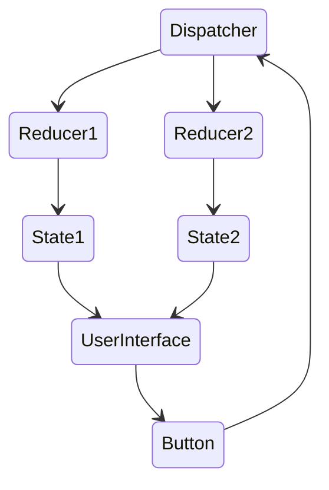

# Fluxor

¿Qué es Fluxor y para que sirve?

---

# Contenido

<Toc minDepth="1" maxDepth="2"></Toc>

---
layout: center
---

<div class="text-center">

# ¿Qué es Fluxor?

Fluxor es una librería .NET que implementa el patrón Flux
</div>

<style>
h1 {
  background-color: #2B90B6;
  background-image: linear-gradient(45deg, #4EC5D4 10%, #146b8c 20%);
  background-size: 100%;
  -webkit-background-clip: text;
  -moz-background-clip: text;
  -webkit-text-fill-color: transparent;
  -moz-text-fill-color: transparent;
}
</style>

---

# ¿Qué es el patrón Flux?

Es un patrón de diseño para el manejo y el flujo de los datos de una aplicación

<div grid="~ cols-2 gap-2">
  <div v-click>

  </div>
  <div>
    <h3 v-click>Reglas</h3>
    <ul>
      <li v-click>El estado <b>sólo</b> puede ser de lectura</li>
      <li v-click>Para alterar el estado de la aplicación se tiene que hacer a través de un <em>dispatcher</em></li>
      <li v-click>Cada <em>reducer</em> que gestiona una acción creará un nuevo estado reflejando el estado actual con los cambios que se piden</li>
      <li v-click>La vista usa el estado de la aplicación para pintar cosas</li>
    </ul>
  </div>
</div>

---

# Crear estados

```csharp {all|1|4|6|8-11} twoslash
[FeatureState]
public class CounterState
{
  public int ClickCount { get; }

  private CounterState() {}

  public CounterState(int clickCount)
  {
    ClickCount = clickCount;
  }
}
```

<!--
Tenemos que definir una clase para reflejar el estado que queramos

[click] Tenemos que añadir el decorador

[click:1] Definimos las propiedades que queramos. IMPORTANTE solo de lectura

[click:1] Necesitamos un constructor sin parametros. Hacemos que sea privado

[click:1] Definimos un constructor publico que permite definir el valor de la accion

[click:1] Con todo eso, tenemos la clase al completo

-->

---

# Consultar el estado

Mediante la inyección de dependencias de Microsoft

```csharp {all|3|5|8|10-18|all} twoslash
public class App
{
  private readonly IState<CounterState> CounterState;

  public App(IState<CounterState> counterState)
  {
    CounterState = counterState;
    CounterState.StateChanged += CounterState_StateChanged;
  }

  private void CounterState_StateChanged(object sender, EventArgs e)
  {
    Console.WriteLine("");
    Console.WriteLine("==========================> CounterState");
    Console.WriteLine("ClickCount is " + CounterState.Value.ClickCount);
    Console.WriteLine("<========================== CounterState");
    Console.WriteLine("");
  }
}
```

---

# Cambiar el estado

Vamos a definir una acción, el uso del dispatcher y el reducer para cambiar el estado

---
level: 2
---

# Definimos una acción

Para este caso va a ser una accion vacía

```csharp
public class IncrementCounterAction {}
```

---
level: 2
---
# Hacemos uso del dispatcher para usar la acción

Refactorizamos para hacer <em>dispatch</em> de esa acción

````md magic-move {lines: true}

```csharp
// Nuestra clase anterior
public class App
{
  private readonly IState<CounterState> CounterState;

  public App(IState<CounterState> counterState)
  {
    CounterState = counterState;
    CounterState.StateChanged += CounterState_StateChanged;
  }
  ...
```

```csharp
public class App
{
  private readonly IState<CounterState> CounterState;
  private readonly IDispatcher Dispatcher;

  public App(IState<CounterState> counterState, IDispatcher dispatcher)
  {
    CounterState = counterState;
    CounterState.StateChanged += CounterState_StateChanged;
    Dispatcher = dispatcher;
  }
  ...
```

```csharp
public class App
{
  private readonly IState<CounterState> CounterState;
  private readonly IDispatcher Dispatcher;

  public App(IState<CounterState> counterState, IDispatcher dispatcher)
  {
    CounterState = counterState;
    CounterState.StateChanged += CounterState_StateChanged;
    Dispatcher = dispatcher;
  }
  
  public void IncrementCounter()
  {
    Dispatcher.Dispatch(new IncrementCounterAction());
  }
  ...
}
```
````
---
level: 2
---

# Reducir la acción

En una nueva clase de Reducers

````md magic-move {lines: true}

```csharp {*|3|4|5}
public static class Reducers
{
  [ReducerMethod]
  public static CounterState ReduceIncrementCounterAction(CounterState state, IncrementCounterAction action) =>
    new CounterState(clickCount: state.ClickCount + 1);
}
```

```csharp {*|4|3}
public static class Reducers
{
  [ReducerMethod(typeof(IncrementCounterAction))]
    public static CounterState ReduceIncrementCounterAction(CounterState state) =>
      new CounterState(clickCount: state.ClickCount + 1);
}
```

```csharp
public static class SomeReducerClass
{
  [ReducerMethod]
  public static SomeState ReduceSomeAction(SomeState state, SomeAction action) => new SomeState();

  [ReducerMethod]
  public static SomeState ReduceSomeAction2(SomeState state, SomeAction2 action) => new SomeState();
}

public static class SomeOtherReducerClass
{
  [ReducerMethod]
  public static SomeState ReduceSomeAction3(SomeState state, SomeAction3 action) => new SomeState();

  [ReducerMethod]
  public static SomeState ReduceSomeAction4(SomeState state, SomeAction4 action) => new SomeState();
}
```

````

---

# Effects

Los estados en Flux son imutables, pero en la realidad hay que hacer llamadas a APIs o consultar bases de datos

````md magic-move {lines: true}

```csharp {*|1|4|5}
[EffectMethod(typeof(FetchDataAction))]
public async Task HandleFetchDataAction(IDispatcher dispatcher)
{
  var data = await DbContext.SomeEntity.ToListAsync();
  dispatcher.Dispatch(new FetchDataResultAction(data));
}
```

```csharp
public class Effects
{
  private readonly DbContextApp DbContext;

  public Effects(DbContextService dbContext)
  {
    DbContext = dbContext;
  }

  [EffectMethod]
  public async Task HandleFetchDataAction(FetchDataAction action, IDispatcher dispatcher)
  {
    var data = await await DbContext.SomeEntity.ToListAsync();
    dispatcher.Dispatch(new FetchDataResultAction(data));
  }
}
```

```csharp
public class FetchDataActionEffect : Effect<FetchDataAction>
{
  private readonly IWeatherForecastService WeatherForecastService;

  public FetchDataActionEffect(IWeatherForecastService weatherForecastService)
  {
    WeatherForecastService = weatherForecastService;
  }

  public override async Task HandleAsync(FetchDataAction action, IDispatcher dispatcher)
  {
    var forecasts = await WeatherForecastService.GetForecastAsync(DateTime.Now);
    dispatcher.Dispatch(new FetchDataResultAction(forecasts));
  }
}
```

````

---
layout: center
---

# Ejemplo práctico con MAUI Blazor

---

# Referencias

- [Repositorio de Fluxor](https://github.com/mrpmorris/Fluxor)
- [Diapositivas de la presentación](https://github.com/juanDeVicente/FluxorSlides)

---
layout: center
---

# ¿Dudas y preguntas?
